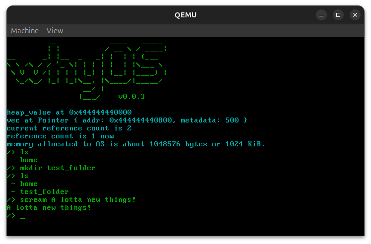

# whyOS v0.0.3



**whyOS** is a tiny, unnecessary, meme-powered operating system written in Rust. It doesn’t have a real reason to exist — and that’s exactly why it does.

---

## 🤔 What even is this?

whyOS is a hobby operating system targeting `x86_64`, built from scratch in Rust. It boots, prints funny messages and runs a custom CLI that lets you type bizarre commands like `yeet` and `scream`.

It’s funny. It’s minimal. It’s educational (sort of). It’s… whyOS.

---

## ✨ Features

✅ VGA text mode output  
✅ Keyboard input handling  
✅ A simple CLI with commands  
✅ Shutdown and reboot support  
✅ Works in QEMU and (mostly) on real hardware  
✅ Working memory management  
✅ Experimental RAMFS (filesystem based on memory)

---

## 🧰 Requirements

Install required components with:

```bash
rustup override set nightly
rustup component add rust-src
cargo install bootimage
```

---

## 🔨 Build & Run

To build the bootable image:

```bash
cargo bootimage
```

To run in QEMU:

```bash
qemu-system-x86_64 -drive format=raw,file=target/x86_64-blog_os/debug/bootimage-why_os.bin
```

> You can also try it on real hardware and kinda works.

---

## 🧑‍💻 CLI Commands
Use the `info <command>` command inside whyOS to see these descriptions directly in the shell.

| Command      | Description                                                                                                              | Usage                 |
|--------------|--------------------------------------------------------------------------------------------------------------------------|-----------------------|
| `ls`         | Lists files and directories in the current directory.                                                                    | `ls`                  |
| `cd`         | Changes the current directory.                                                                                           | `cd <path>`           |
| `mkfile`     | Creates an empty file in the current directory.                                                                          | `mkfile <filename>`   |
| `mkdir`      | Creates a new directory in the current directory.                                                                        | `mkdir <dirname>`     |
| `rem`        | Removes a file or directory.                                                                                             | `rem <name>`          |
| `readfile`   | Reads and prints the contents of a file.                                                                                 | `readfile <filename>` |
| `banner`     | Displays the system banner and OS version.                                                                               | `banner`              |
| `whyver`     | Shows information about the current OS release.                                                                          | `whyver`              |
| `memtest`    | Stress-tests the RAM filesystem by continuously creating files until allocation fails. Useful for testing memory limits. | `memtest`             |
| `hello`      | Prints `Hello World!` to the screen.                                                                                     | `hello`               |
| `scream`     | Echoes the given text back to the screen.                                                                                | `scream <text>`       |
| `yeet`       | Clears the screen.                                                                                                       | `yeet`                |
| `bye`        | Shuts down the system *(may not work on real hardware)*.                                                                 | `bye`                 |
| `oops`       | Reboots the system *(may not work on real hardware)*.                                                                    | `oops`                |
| `listcolors` | Lists all available text colors.                                                                                         | `listcolors`          |
| `setfg`      | Sets the foreground (text) color.                                                                                        | `setfg <color>`       |
| `setbg`      | Sets the background color.                                                                                               | `setbg <color>`       |
| `info`       | Explains what a command does.                                                                                            | `info <command>`      ||                                                                                                                          |                       |

---

## 🤝 Contributing

You can help this project grow by:

- Submitting bug reports or issues
- Sending pull requests

---

## 📜 License

MIT
